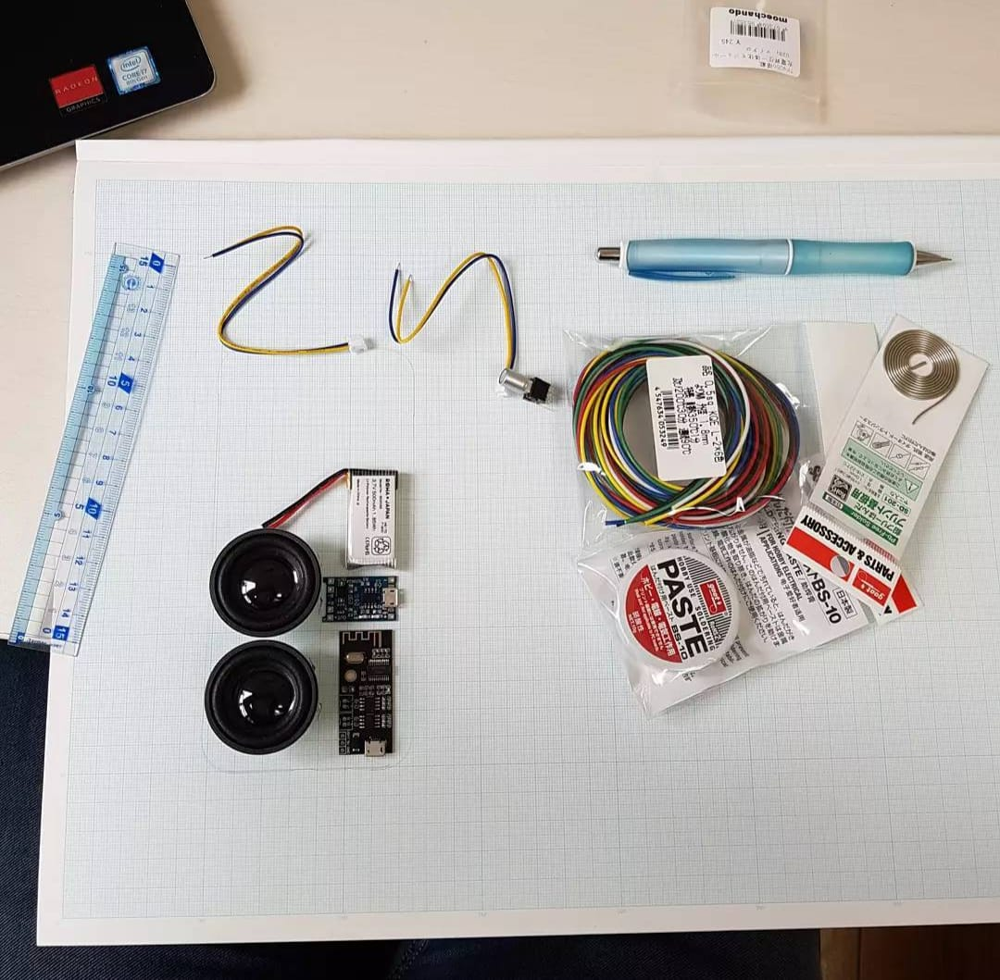
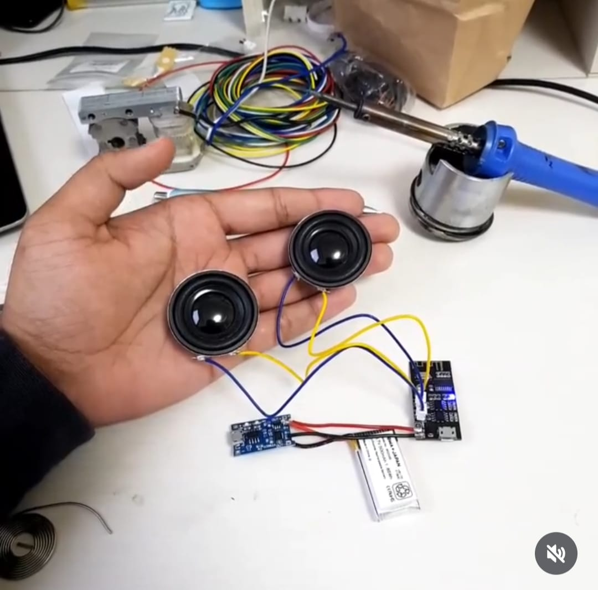
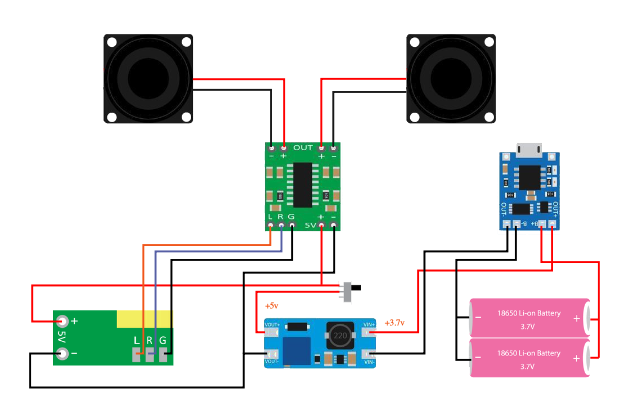

# Bluetooth Speaker Build

> _Basic Bluetooth Speaker build to learn about circuitry and soldering_

## 1) Overview
- **Dates:** 17-09-2021
- **Tools:** Soldering iron, flux, CAD for enclosure, finishing tools
- **Skills:** Circuit basics, driver selection, acoustic enclosure design
- **Outcome:** Compact speaker with Bluetooth connectivity; clean sound with minimal resonance

## 2) Gallery

 - found online

> Embed short clips via links:  
> - Build timelapse: https://youtu.be/your-video
> - Drive folder (raw media): https://drive.google.com/your-folder

## 3) Bill of Materials (BOM)
| Item | Spec | Source | Cost |
|---|---|---|---|
| Drivers | 2x 20mm drivers | Hardware and Electronics store | $8 |
| Bluetooth Audio Module | ESP32 | Hardware and Electronics store | $4 |
| Battery | Li-ion 800mAh with JST connector | Hardware and Electronics store | $10 |
| Wires | Assorted wires | Hardware and Electronics store | $1 |
| Switch | Push switch | Hardware and Electronics store | $0.3 |
| Flux | Standard soldering paste | Hardware and Electronics store | $0.98 |
| Soldering coil | Standard solder | Hardware and Electronics store | $0.40 |
| Case | Clear Casette case | Hardware and Electronics store | $5 |
| Channel splitter | charging and channel spliter circuit board | Hardware and Electronics store | $2 |

## 4) Process Notes
- **Design assumptions:** 
- **Calculations / checks:** …  
- **Tolerances / fasteners:** …  
- **Testing:** …

Build Log (expand)

- YYYY-MM-DD — Note + photo link  
- YYYY-MM-DD — Note + photo link

## 5) Challenges & Solutions
- **Issue:** … → **Fix:** … → **Result:** …
- **Issue:** … → **Fix:** … → **Result:** …

## 6) Results
- Photos of the final build, performance measures, acceptance criteria met.

## 7) Reflection (STAR)
- **Situation:** …  
- **Task:** …  
- **Action:** …  
- **Result:** …  
- **Transferable learning:** …

---

**Repo pointers:** Put images in `media/`, keep filenames descriptive. Larger assets go to cloud + link here.
