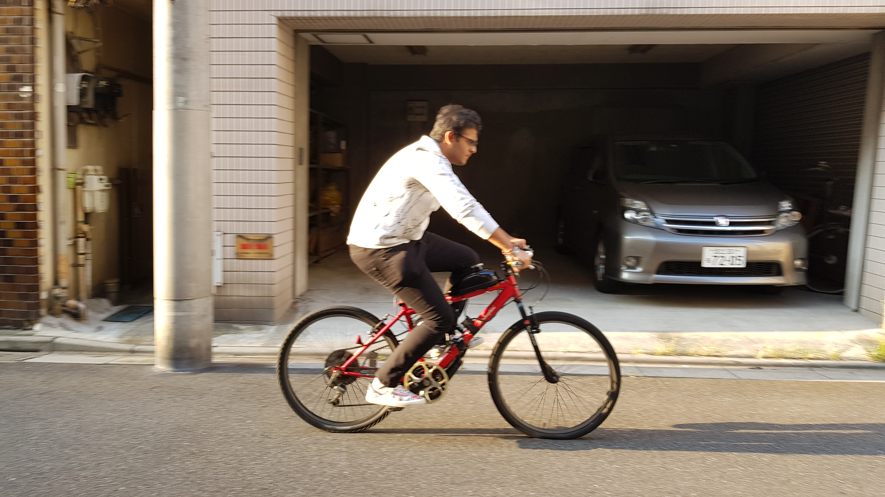
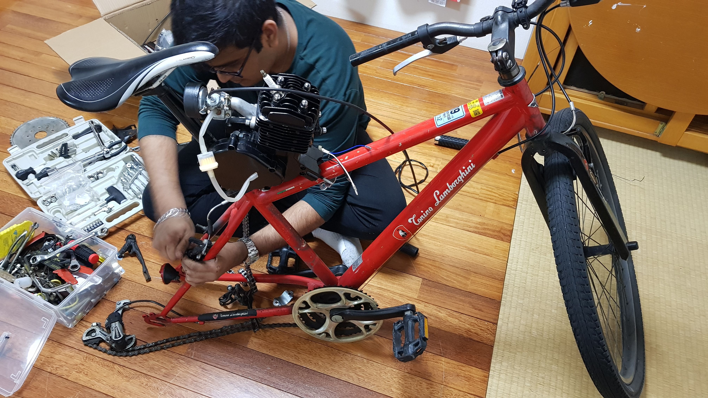
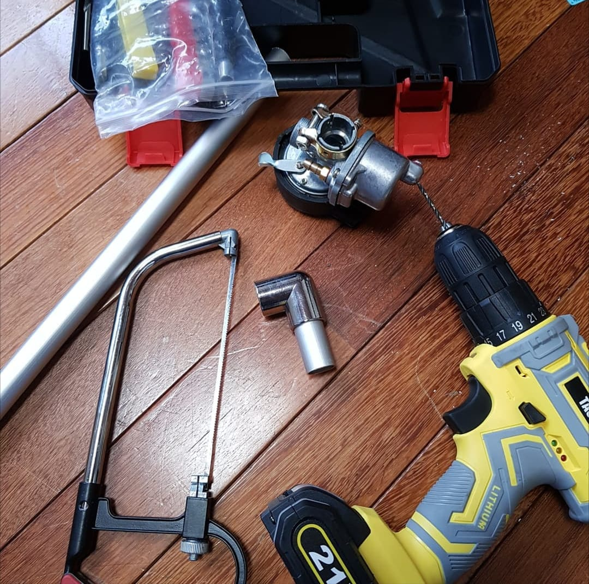
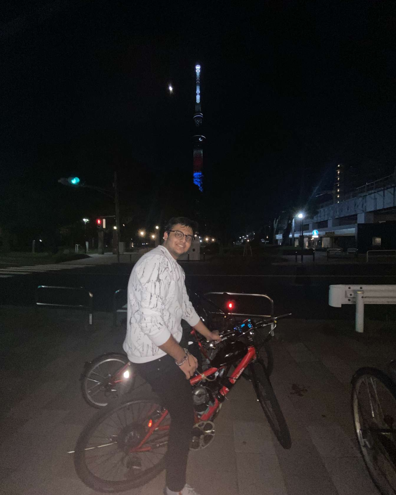

# Motorised Bike Build

> Converted my old bike into a motorized one, learnt about mechanical systems, assembly and fitment techniques and had lots of fun!

## 1) Overview
- **Dates:** Feb–Sept 2021
- **Tools:** Hand tools, torque wrench, calipers, Loctite, CAD (for brackets)
- **Skills:** Mechanical assembly, alignment, mounting design, safety checks, prototyping, maintanance
- **Outcome:** A fun motorized bike that runs on a 2-Stroke 89cc engine that reaches 54 kph

## 2) Gallery

- Had initially designed to have the engine mounted on the top frame and seat column however with issues in mounting brackets and misaligned chain position.

- Mounting the engine inside the frame was a step towards improvement however the chassis was too small for the carbutor to fit, used an L bracket and temperature resistant steel epoxy for a workaround.

- Ran multiple tests alongside prototyping and troubleshooting ideas for enhancing the ride quality and ensuring safety.

> Embed short clips via links:  
> - Build timelapse: https://youtu.be/your-video
> - Drive folder (raw media): https://drive.google.com/your-folder

## 3) Bill of Materials (BOM)
| Item | Spec | Source | Cost |
|---|---|---|---|
| Bike | Lamborghini Mountain Trail | Donated by a friend | $0 |
| Sprocket | 44 tooth | Engine Kit | $19.86 |
| Clutch cable | 2m length | Engine Kit | $15.36 |
| Throttle Body | standard | Engine Kit | $10.86 |
| Chain | 3m length | Local Bike Shop | $23 |
| Racing Carburator | increased air intake | Alibaba | $7.89 |
| Gas Tank | Aluminium Tank with filter | Alibaba | $44 |
| Engine | 89cc 2 Stroke engine | Engine Kit (Alibaba) | $300 |
| Spark Plug + Solenoid | standard | Bike Shop | $35 |
| Mounting brackets | U Brackets | Local Hardware store | $15 |
| Engine Oil | Suzuki super 2 cycle engine oil | Autobacs | $14 |
| Steel Epoxy | High temperature resistant metal epoxy JB Weld brand | Local Hardware store | $12 |

## 4) Process Notes
- **Design assumptions:**
  - Assumed average rider weight to be 80kgs, to be run ideally on pavement/ urban terrains with occasional inclines (no extreme off-roading)
  - For occasional use with 100 hours of running between each maintanence cycle
  - Target top speed of 50 kph and 35 kph safe crusing speed
  - Assumed efficiecny values of 80%, (losses in chain tension, gear, sprockets, clutch)
  - Mounting points to be structurally strong and enough to support the load of the rider and the engine
  
- **Calculations / checks:**
  - Checked engine specifications provided by manufacturer : 1.5 Hp = 1.103 kW, 2.7 NM of torque at 6500 RPM
  - Gear Ratio of 44 tooth to 16 tooth sprocket
  - Assumed solenoid timings to be set by factory (no modifications)
  
- **Tolerances / fasteners:**
  - Chain alignment within 5mm to prevent derailment
  - Used nuts with loctite for vibration
  - Ensure clearnace between moving parts of 5 to 10mm
  - Rubber pads fastened between mounting points to dampen vibration
     
- **Testing:**
  - Checked the fitment of all parts on the bike, ensuring a safe clearnance between all dynamic parts and the chassis.
  - Bench tested the motor to ensure compression was adequet for idling
  - checked all electrical wiring was water-proof and sealed from elements
  - Static load test was done to check if the bike could handle the load of the rider and engine, checked for frame deformation
  - Tested at low speeds for motor starting up, checks for oil leaks and motor idling
  - Tested at medium and target speed to verify motor capabilities
  - braking test with added motor and fuel mass
  - incline test to verify motor assistance was sufficient
  - checked for overheating after idling for 30 mins
  - inspected oil for metallic parts if piston was not lubricated succifiently
  - planned maintanence after 100 km of use to identify fatigue and loosening of fasteners. 

Build Log (expand)

- 21-02-2021 — Recieved the bike from a friend who was going to scrap it  
- 01-03-2021 — Placed an order for an engine kit from Alibaba after doing research on youtube and people's custom builds
- 13-04-2021 - Recieved engine kit, Prepared the bike for mounting the engine and components
- 14-04-2021 - Mounted the engine, gas tank and solenoid coil
- 18-04-2021 - Recieved carburator in the mail and found issues with attaching it due to collision with frame
- 21-04-2021 - Thought of redirecting airflow and carburator to the side such that it does not interfere with the frame of the bike
- 27-04-2021 - Got aluminium pipe of 20mm OD 2.5mm thick and a 90degree L joint for the carburator, used JB Weld steel epoxy
- 08-05-2021 - Reassembled the bike and ensured brakes were aligned after wheels were modified with the sprocket
- 09-05-2021 - Performed initial tests at low speeds to check for oil leaks, vibrations and chain tension
- 09-05-2021 - Chain tension was poor (severe chain slack even on highest tension setting)
- 26-05-2021 - Bought a dedicated chain breaker tool to dial in the right sized chain and tension correctly
- 30-05-2021 - Performed medium and high speed tests at Sumida river pavement (ensured safety for pedestrians and myself)
- 02-06-2021 - Performed incline tests with motor on idle and on motor power at 40%
- 10-06-2021 - Disassembled the engine after a break in period to inspect the condition of the motor and identify fatigue/stress points
- 11-06-2021 - Cleaned up the exhuast and experimented with various fuel and oil ratios for better efficiency and lower emissions

## 5) Challenges & Solutions
- **Issue:** Carburator fitment not aligning with frame → **Fix:** designed and manufactured an L joint that allowed fitment at an angle → **Result:** carburator set at a slightly longer distance from the engine leading to a reduced air/fuel mixture pressure.
- **Issue:** Engine would not start after sufficient pedalling and kick starting → **Fix:** tighened the loose chain tension which was causing a lot of loss in power, increased the diameter of the carburator nozzle to 1.8mm allowing for a higher fuel/air ratio → **Result:** engine was running richer and idled at a low RPM effectively
- **Issue:** Engine was burning too much oil, grey and white smoke from the exhuast after 5 mins of idle running → **Fix:** researched optimal ratios and experimented till less/no smoke was coming out of the exhuast → **Result:** increased efficiency of the engine and reduced carbon buildup

## 6) Results
- Photos of the final build, speed tests, satisfactory criterias were met:
  

## 7) Reflection (STAR)
- **Situation:** In early 2021, I wanted to apply my mechanical engineering curiosity outside of coursework by experimenting with converting a conventional mountain bike into a motorised vehicle. This personal project gave me the opportunity to learn about small-scale powertrains, mounting systems, and the challenges of integrating components that were not originally designed to fit together.
  
- **Task:** My goal was to design and assemble a reliable motorized bike using a 2-stroke engine, acheiving safe and consistent performance while maintaining structural integrity. I needed to ensure mounting, tolerancing and alignments were all kept within acceptable limits to avoid chain derailment, vibration damage and unsafe operation.

- **Action:** I began by defining design assumptions such as rider load, terrain, operational limits, target speeds and efficiency values. I then performed key checks on torque output, sprocket ratios, engine compression and chain tension. During the build, I came across several challenges such as misaligned mounting brackets and a carburator that collided with the frame. To resolve these, I desgined a custom bracket, reinforced mounts with rubber pads, high temperature epoxy and fine-tuned the chain length using a breaker tool for proper alignment and tension. I implemented tolerances such as 5-10 mm gaps between dynamic parts to avoid grinding and damage to the frame, applied loctite on bolts to counter vibrations, and tested the bike incrementally from bench testing to incline and speed trials to ensure safety and performance at each stage of the build.
  
- **Result:** The final build successfully reached a top speed of 54kph and effectively ran at a cruising speed of 35 kph, exceeding my original performance targets. Through systematic testing, I was able to troubleshoot issues such as chain slack, improper fuel ratios, mechanical alignments and ultimately acheiving a smooth idling ride with improved efficiency and reduced exhuast smoke.  

- **Transferable learning:** This project strengthened my understanding of real-world mechanical fitments, tolerances, and iterative testing prodecures. I learnt the importance of structed design assumptions and validation checks through progressive testing that allowed me to operate machinery safely. Beyond technical skills, it improved my ability to troubleshoot under uncertainty and helped me think more closely about budgeting when working on project while ensuring to adapt creatively using off the shelf components,while applying engineering judgement to each stage. These lessons are directly transferable to professional engineering contexts such as prototyping, mechanical systems integration and design for maintenance.

